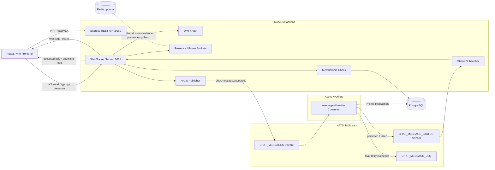
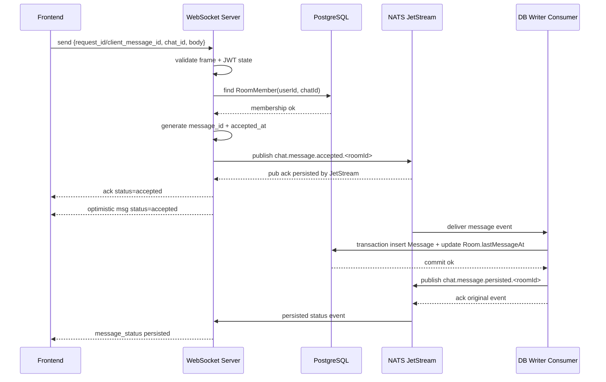
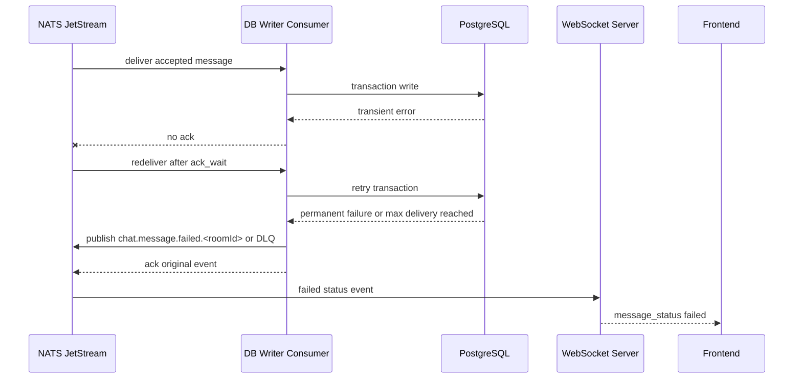

# NATS JetStream 架構改造設計

## 0. 這份設計做了什麼

本文件以目前 `backend-sketch` 的實際程式碼為基準，評估把 WebSocket send message 的同步 DB 寫入路徑改成 NATS JetStream 非同步持久化是否合適，並提出可落地的 migration path。

目前實作重點：

- REST API 跑在 `:8080`，Express routes 掛在 `/api/v1/auth`、`/api/v1/chats`、`/api/v1/users`。
- WebSocket server 跑在 `:8081`。
- Prisma + PostgreSQL 是唯一持久化來源。
- `Redis` 在 docker compose 有開，但目前程式碼沒有實際使用 Redis client。
- realtime 目前使用 `InMemoryPresenceStore` 管理 `roomSockets`、`clientStates`、presence、typing、broadcast。
- `send` flow 目前同步呼叫 `createMessage()`，完成 membership 查詢、message insert、`Room.lastMessageAt` update 後，才回 ack 與 broadcast。

本文件的目標不是把聊天系統瞬間重寫成完整微服務，而是先把「前端體感延遲」和「DB 寫入吞吐瓶頸」拆開，讓 WebSocket server 可以快速接收訊息、快速回覆 accepted ack，DB 寫入由 JetStream consumer 平滑處理。

### 2026-06-01 實作狀態

目前已在 `backend-sketch` 接上 Phase 1 NATS JetStream：

- `docker-compose.yml` 新增 `nats:2.10-alpine`，開啟 JetStream 與 monitoring port `8222`，store dir 指到 `/data/jetstream` volume。
- app container 加上 `NATS_URL=nats://nats:4222`。
- `backend/src/modules/messaging/nats-client.ts` 負責 NATS connection、JetStream stream 初始化與 publish。
- `CHAT_MESSAGES` stream 收 `chat.message.accepted.*`。
- `CHAT_MESSAGE_STATUS` stream 收 `chat.message.persisted.*`、`chat.message.failed.*`。
- `message-db-writer` durable pull consumer 非同步寫 PostgreSQL，成功後 publish persisted status，失敗達重送上限後 publish failed status。
- `realtime.server.ts` 的 WS send flow 在 NATS 開啟時改成：membership check → 產生 `message_id` → publish accepted event → 立即回 `ack status=accepted` → optimistic broadcast。
- `realtime.server.ts` 也訂閱 persisted/failed status，轉發 `message_status` frame 給聊天室在線 clients。

修正過的實作問題：

- 一開始使用 `js.subscribe()` 會建立 push consumer，但未提供 `deliver_subject`，app 啟動會噴 `push consumer requires deliver_subject`。目前已改為 JetStream durable pull consumer：`js.consumers.get(...).consume(...)`。
- k6 腳本原本把完整 `RUN_ID` 放進 username，太長會被後端註冊規則擋下。現在 username 只取短版 run id，report/request id 仍保留完整 run id。

smoke test 驗證：

```txt
run_id=nats-smoke-202606010836
WebSocket 連線成功率：100.00%
實際送出：63 messages
ack received：60
ack p95 ≈ 0.02s
DB Message 筆數：63
JetStream CHAT_MESSAGES：63 messages
JetStream CHAT_MESSAGE_STATUS：63 messages
```

---

## 1. 是否適合使用 NATS JetStream

結論：適合，但要先接受「ack 語意會改變」。目前 ack 代表「已寫入 DB」。導入 JetStream 後，第一個 ack 應該改成「server 已驗證並 durable accepted」，也就是訊息已寫入 JetStream，不等於已寫入 PostgreSQL。

### 適合的原因

1. WebSocket send path 目前被 PostgreSQL 同步寫入拖慢。JetStream 可以把 DB write 從 WS request path 拆出去。
2. JetStream 是 durable queue，不是單純 pub/sub。WS server publish 成功後，即使 consumer crash，訊息仍可重送。
3. JetStream 支援 ack、redelivery、durable consumer、max delivery、stream retention，適合做「可靠非同步寫入」管線。
4. NATS client 在 Node.js / TypeScript 生態成熟，和現有 Express + ws app 可以直接整合。
5. 系統現在還小，導入成本比 Kafka 低，local compose、測試和 demo 都比較輕。

### 不適合或要小心的地方

1. 如果產品要求「ack 必須代表 DB 已持久化」，那 JetStream 只能改善 consumer 端吞吐，不能立即降低 ack latency。
2. 即時 broadcast optimistic message 代表前端可能短暫看到 `pending` message，之後才變 `persisted` 或 `failed`。
3. Message ordering、duplicate、reconnect 補訊息都必須明確設計，不能只把 `createMessage()` 改成 publish。
4. 目前 `InMemoryPresenceStore` 不支援多 WS instance。JetStream 解決 DB write queue，不會自動解決跨 instance socket fanout。

建議：採用 JetStream，但分階段落地。

- Phase 1：單 app instance，JetStream 只負責 message write queue。
- Phase 2：加入 message status 通知與 REST 補償查詢。
- Phase 3：多 app instance 時再處理 Redis/NATS fanout 或 sticky session 策略。

---

## 2. 新的 Message Flow

### 2.1 Frame 命名建議

目前 FE 送：

```json
{ "type": "send", "request_id": "...", "chat_id": "...", "body": "..." }
```

建議保留相容，但語意整理成：

- `request_id`：舊欄位，短期保留。
- `client_message_id`：FE 產生的 idempotency key，建議用 ULID。新 FE 優先送這個。
- `message_id`：BE 在 publish 前產生的 authoritative message id，建議用 UUID 或 ULID。
- `status`：`accepted`、`persisted`、`failed`。

短期可以讓：

```ts
const clientMessageId = frame.client_message_id ?? frame.request_id;
```

### 2.2 新 flow

1. FE 送出 `send` frame。
2. WS server 驗 JWT。連線建立時已驗一次，send 時仍使用連線 state 的 `userId`。
3. WS server 同步檢查 membership。這一步仍建議同步做，否則非會員可以被 optimistic broadcast。
4. WS server 驗證 body、chat_id、client_message_id。
5. WS server 產生 `message_id`、`accepted_at`。
6. WS server publish event 到 JetStream。
7. JetStream publish 成功後，WS server 立即回 `ack` 給 sender，語意是 `accepted`。
8. WS server broadcast optimistic `msg` 給 room sockets，status 是 `pending` 或 `accepted`。
9. JetStream consumer 非同步 consume event。
10. Consumer 使用 Prisma transaction 寫入 `Message`，並更新 `Room.lastMessageAt`。
11. 寫入成功後，consumer 發出 `message.persisted` event。
12. WS server 訂閱 persisted event，通知在線 clients 把該 message 狀態更新成 `persisted`。
13. 寫入失敗且不可重試後，consumer 發出 `message.failed` event 或送到 DLQ，WS server 通知 sender 失敗。

### 2.3 Ack protocol 建議

第一階段不要讓 ack 同時代表 accepted 和 persisted，否則語意混亂。建議改成兩段式：

```json
{
  "type": "ack",
  "request_id": "client-msg-01",
  "client_message_id": "client-msg-01",
  "message_id": "server-msg-01",
  "status": "accepted",
  "accepted_at": "2026-06-01T04:00:00.000Z"
}
```

後續狀態更新：

```json
{
  "type": "message_status",
  "client_message_id": "client-msg-01",
  "message_id": "server-msg-01",
  "chat_id": "room-01",
  "status": "persisted",
  "persisted_at": "2026-06-01T04:00:00.120Z"
}
```

失敗：

```json
{
  "type": "message_status",
  "client_message_id": "client-msg-01",
  "message_id": "server-msg-01",
  "chat_id": "room-01",
  "status": "failed",
  "reason": "db_write_failed"
}
```

Optimistic message broadcast：

```json
{
  "type": "msg",
  "message": {
    "id": "server-msg-01",
    "client_message_id": "client-msg-01",
    "chat_id": "room-01",
    "sender_id": "user-01",
    "type": "TEXT",
    "body": "hello",
    "created_at": "2026-06-01T04:00:00.000Z",
    "status": "accepted"
  }
}
```

---

## 3. JetStream Stream、Subject、Consumer 設計

### 3.1 Streams

建議先用兩個 stream：

#### `CHAT_MESSAGES`

用途：接收 WS server publish 的 message command。

Subjects：

```text
chat.message.accepted.*
```

其中 `*` 是 `roomId`。例如：

```text
chat.message.accepted.room_abc
```

Retention：`limits`。

Storage：production 用 `file`。

Duplicate window：建議至少 2 到 10 分鐘，搭配 `Nats-Msg-Id`。

#### `CHAT_MESSAGE_STATUS`

用途：consumer 寫 DB 成功或最終失敗後，發布狀態事件給 WS server。

Subjects：

```text
chat.message.persisted.*
chat.message.failed.*
```

### 3.2 Subject 設計

建議格式：

```text
chat.message.accepted.<roomId>
chat.message.persisted.<roomId>
chat.message.failed.<roomId>
```

好處：

- 依 room 做 subject partition，未來可以擴充成不同 consumer 處理不同 room shard。
- WS server 訂閱 `chat.message.persisted.*` 就可以收到所有 persisted 狀態。
- k6 或 observability 可以按 subject 統計。

### 3.3 Consumer 設計

#### `message-db-writer`

- Durable consumer。
- Subject filter：`chat.message.accepted.*`。
- Ack policy：explicit ack。
- Ack wait：例如 30 秒，依 DB 寫入 p99 調整。
- Max deliver：例如 5 到 10 次。
- Deliver policy：all 或 new，正式環境用 durable 保存進度。
- Concurrency：初期 1 到 N 個 worker，但要注意 ordering。

#### `message-status-fanout`

這不一定要 durable。如果 WS server 掛掉，client reconnect 後會靠 REST 補訊息，不必要求 status event 全部 durable fanout。可以用一般 NATS subscription 或 JetStream ephemeral consumer。

---

## 4. 關鍵問題處理

### 4.1 Message ordering

聊天系統的 ordering 通常只保證「同一 room 內大致依 server accepted time / persisted time 排序」。不要保證全域排序。

建議：

1. `message_id` 使用 ULID，天然可按時間排序。
2. Event payload 帶 `accepted_at`，DB `createdAt` 建議使用這個時間，而不是 DB default now。
3. 同 room 的 consumer concurrency 要謹慎。最簡單做法是先用單 consumer worker，確保順序最穩。
4. 若要提高吞吐，可做 room shard：`hash(roomId) % N`，每個 shard 單序處理。

注意：JetStream subject 本身不是完整的 per-room ordered transaction log。多 worker 平行處理同一 room 時，DB 寫入順序可能亂掉。

### 4.2 Duplicate / idempotency

必須做兩層 idempotency。

#### JetStream publish idempotency

Publish 時設定 message id：

```text
Nats-Msg-Id = <senderId>:<clientMessageId>
```

在 duplicate window 內，JetStream 可幫忙拒絕重複 publish。

#### DB idempotency

目前 schema 已有：

```prisma
@@unique([senderId, requestId])
```

建議改名或新增：

```prisma
clientMessageId String
status          MessageStatus @default(PERSISTED)
acceptedAt      DateTime
persistedAt     DateTime?

@@unique([senderId, clientMessageId])
@@index([roomId, acceptedAt])
@@index([roomId, createdAt])
```

如果短期不改 schema，可以先沿用 `requestId` 當 `clientMessageId`。

Consumer insert 遇到 unique conflict 時，應查回既有 message，視為成功，並 publish persisted status。這樣 FE retry 不會造成重複訊息。

### 4.3 Retry

Consumer 寫 DB 失敗時：

- transient error，例如 DB connection issue、timeout：不要 ack JetStream message，讓它 redeliver。
- permanent error，例如 payload schema 不合法、room 不存在、FK 永久失敗：ack 原 message，另外 publish failed event 或寫 DLQ。

建議分類：

```text
retryable: connection reset, timeout, pool exhausted, serialization failure
non-retryable: validation failed, foreign key invalid, payload cannot decode
```

### 4.4 Dead Letter Queue

JetStream 沒有像某些 queue 系統自動 DLQ 的固定模型，但可以用 max delivery + advisory 或 consumer 自己轉發。

建議簡化做法：

1. Consumer 檢查 `msg.info.redeliveryCount`。
2. 超過 `MAX_DELIVER` 時 publish 到：

```text
chat.message.dlq.<roomId>
```

3. ack 原 message，避免無限重送。
4. DLQ payload 保留原 event、錯誤原因、redelivery count。
5. 後台或 script 可重放 DLQ。

### 4.5 DB 寫入失敗

分兩種：

#### 可恢復

例如 DB 短暫 unavailable。Consumer 不 ack，JetStream 重送。FE 已收到 accepted，UI 先顯示 pending。若很久沒 persisted，可以顯示「同步中」。

#### 不可恢復

例如 room 被刪除、membership 在 accepted 後被移除。Consumer publish failed event。前端把 optimistic message 標記 failed，允許重試或移除。

### 4.6 WS server crash

如果 crash 發生在 publish 前：FE 沒收到 accepted ack，FE timeout 後用同一 `client_message_id` retry。

如果 crash 發生在 publish 後、ack 前：FE retry，JetStream 或 DB idempotency 會去重。

如果 crash 發生在 accepted ack 後：consumer 仍會寫 DB。FE reconnect 後用 REST history 補回 persisted message。

### 4.7 Consumer crash

Consumer explicit ack 前 crash，JetStream 會 redeliver。DB idempotency 保證重送不重複 insert。

Consumer 寫 DB 成功但 publish persisted status 前 crash，下一次 redelivery 插入會遇到 duplicate，consumer 查回 message 並補 publish persisted status。

### 4.8 FE reconnect 後補訊息

FE reconnect 後不應依賴 WS server 補所有 missed frames。建議：

1. FE local store 保留 pending messages，key 是 `client_message_id`。
2. reconnect 後呼叫 REST：

```text
GET /api/v1/chats/:id/messages?after_message_id=<lastPersistedMessageId>
```

目前 API 只有 `before_message_id` 分頁，建議新增 `after_message_id` 或 `since`。

3. FE 用 `message_id` 或 `[sender_id, client_message_id]` merge。
4. pending 很久沒出現在 REST history 的 message 可顯示「仍在同步」或「可能失敗，點擊重送」。

### 4.9 Room.lastMessageAt 一致性

目前每則 message insert 後立刻 update room。非同步後建議在同一 transaction 裡做：

```sql
insert message;
update room set lastMessageAt = greatest(lastMessageAt, message.createdAt)
where id = roomId;
```

Prisma 寫法要避免較舊訊息覆蓋較新時間。可以用 raw SQL 或先查再條件更新。

最穩做法：

- `Message.createdAt` 使用 accepted_at。
- Transaction 內 insert message。
- Transaction 內條件更新 `Room.lastMessageAt`，只在 incoming createdAt 更新時才改。

---

## 5. 新架構圖



## 6. Sequence Diagram



失敗情境：



---

## 7. 哪些仍必須同步查 DB，哪些可非同步

### 必須同步

1. JWT 驗證：WS connection 建立時同步驗證。
2. Membership check：send 前同步確認 user 是 room member。否則會把 unauthorized message accepted 或 broadcast。
3. 基本 payload validation：`chat_id`、`body`、`client_message_id`。
4. Rate limit / message size limit：建議同步做，保護 JetStream 和 DB。
5. Room 是否存在：可以和 membership check 合併。

### 可以非同步

1. Message insert。
2. `Room.lastMessageAt` update。
3. unread count 聚合。
4. notification fanout。
5. search indexing。
6. analytics / audit log。

### 可快取但要有失效策略

Membership check 是熱路徑。可以用 Redis cache：

```text
room_member:<roomId>:<userId> = true
TTL 30s to 5m
```

但 room membership 變更時要 invalidation。初期可以先查 DB，等壓測證明 membership query 是瓶頸後再加 cache。

---

## 8. Redis 是否仍需要，以及 Redis / NATS 邊界

需要，但責任要切清楚。不要讓 Redis 和 NATS 都負責 message durability。

### NATS JetStream 負責

- Durable message write queue。
- Message accepted event。
- DB writer retry / redelivery。
- Persisted / failed status event。
- DLQ。

### Redis 負責

- Presence 狀態：user online/offline、socket instance mapping。
- Room socket membership 的跨 instance 查詢或短期狀態。
- Rate limit counter。
- 短 TTL membership cache。
- 可選：跨 instance lightweight pub/sub fanout。

### 不建議 Redis 負責

- 不建議用 Redis pub/sub 做可靠 message write queue，因為 pub/sub 不 durable。
- 不建議把 Redis 當最終 message store。

### 多 instance fanout 選擇

有兩種可行路線：

1. Redis pub/sub 做跨 WS instance fanout，NATS JetStream 做 durable DB write queue。
2. NATS core pub/sub 做跨 WS instance fanout，JetStream 做 durable queue。

如果團隊已經導入 NATS，路線 2 可以減少技術種類。但 Redis 對 presence/rate limit 仍好用。

---

## 9. Node.js / TypeScript 實作建議

### 9.1 套件

```bash
npm install nats ulid
```

### 9.2 docker compose 加 NATS

```yaml
nats:
  image: nats:2.10-alpine
  command: ["-js", "-m", "8222"]
  ports:
    - "4222:4222"
    - "8222:8222"
  volumes:
    - nats_data:/data
```

app env：

```text
NATS_URL=nats://nats:4222
```

### 9.3 Event payload

```ts
export interface ChatMessageAcceptedEvent {
  event_version: 1;
  message_id: string;
  client_message_id: string;
  request_id?: string;
  room_id: string;
  sender_id: string;
  body: string;
  accepted_at: string;
}
```

### 9.4 Publisher

```ts
import { connect, JSONCodec, headers } from 'nats';

const jc = JSONCodec<ChatMessageAcceptedEvent>();

export async function publishAcceptedMessage(event: ChatMessageAcceptedEvent) {
  const nc = await connect({ servers: process.env.NATS_URL });
  const js = nc.jetstream();
  const h = headers();
  h.set('Nats-Msg-Id', `${event.sender_id}:${event.client_message_id}`);

  await js.publish(
    `chat.message.accepted.${event.room_id}`,
    jc.encode(event),
    { headers: h },
  );
}
```

實務上不要每次 send 都 connect。應在 app startup 建一個 singleton NATS connection，graceful shutdown 時 drain。

### 9.5 WS handleSend pseudo-code

```ts
async function handleSend(state: ClientState, frame: RawFrame) {
  const clientMessageId = getClientMessageId(frame);
  validateSendFrame(frame, clientMessageId);

  const membership = await prisma.roomMember.findUnique({
    where: { userId_roomId: { userId: state.user.userId, roomId: frame.chat_id } },
  });
  if (!membership) return sendError(state.ws, 'forbidden', 'Not a member of this chat');

  const event = {
    event_version: 1,
    message_id: ulid(),
    client_message_id: clientMessageId,
    request_id: frame.request_id,
    room_id: frame.chat_id,
    sender_id: state.user.userId,
    body: frame.body.trim(),
    accepted_at: new Date().toISOString(),
  };

  await messagePublisher.publishAccepted(event);

  sendJson(state.ws, {
    type: 'ack',
    request_id: frame.request_id,
    client_message_id: event.client_message_id,
    message_id: event.message_id,
    status: 'accepted',
    accepted_at: event.accepted_at,
  });

  presenceStore.broadcastToRoom(event.room_id, {
    type: 'msg',
    message: toOptimisticMessage(event),
  });
}
```

### 9.6 Consumer + Prisma transaction

```ts
async function persistMessage(event: ChatMessageAcceptedEvent) {
  return prisma.$transaction(async (tx) => {
    const createdAt = new Date(event.accepted_at);

    const existing = await tx.message.findUnique({
      where: {
        senderId_clientMessageId: {
          senderId: event.sender_id,
          clientMessageId: event.client_message_id,
        },
      },
    });
    if (existing) return existing;

    const msg = await tx.message.create({
      data: {
        id: event.message_id,
        senderId: event.sender_id,
        roomId: event.room_id,
        content: event.body,
        clientMessageId: event.client_message_id,
        requestId: event.request_id,
        createdAt,
      },
    });

    await tx.$executeRaw`
      UPDATE "Room"
      SET "lastMessageAt" = GREATEST("lastMessageAt", ${createdAt})
      WHERE "id" = ${event.room_id}
    `;

    return msg;
  });
}
```

如果短期沿用 `requestId`，unique where 要改成目前的 `senderId_requestId`。

### 9.7 Consumer ack pseudo-code

```ts
for await (const msg of consumer.consume()) {
  const event = jc.decode(msg.data);
  try {
    const persisted = await persistMessage(event);
    await publishPersistedStatus(event, persisted);
    msg.ack();
  } catch (err) {
    if (isRetryable(err) && msg.info.redeliveryCount < MAX_DELIVER) {
      msg.nak();
      continue;
    }

    await publishFailedStatusOrDlq(event, err);
    msg.ack();
  }
}
```

### 9.8 Prisma schema 建議

短期最小修改：沿用 `requestId`，但讓 WS server 必填 request_id，並由 server 產生 `id`。

中期建議：

```prisma
enum MessageStatus {
  ACCEPTED
  PERSISTED
  FAILED
}

model Message {
  id              String        @id
  content         String
  createdAt       DateTime
  acceptedAt      DateTime
  persistedAt     DateTime?
  requestId       String?
  clientMessageId String
  status          MessageStatus @default(PERSISTED)

  senderId String
  roomId   String

  sender User @relation(fields: [senderId], references: [id])
  room   Room @relation(fields: [roomId], references: [id])

  @@unique([senderId, clientMessageId])
  @@index([roomId, createdAt])
  @@index([roomId, acceptedAt])
  @@index([senderId, clientMessageId])
}
```

如果 DB 只保存成功訊息，`status` 可以不用放在 `Message`，failed 狀態存在 client 或 `MessageFailure` table。但為了 debug 與補償，建議保留 outbox/status table。

---

## 10. 風險與替代方案

### 10.1 風險

1. Ack 語意改變，前端必須能顯示 pending/persisted/failed。
2. Optimistic broadcast 可能讓其他人短暫看到後來寫入失敗的訊息。
3. Membership 在 accepted 後可能變更，consumer 寫入時是否重新檢查要先定義。
4. Ordering 如果做多 worker 會變複雜。
5. 多 WS instance fanout 仍未解決，JetStream 不是 presence store。
6. 系統多了一個基礎設施，部署、監控、備份、容量規劃都要做。
7. 如果 PostgreSQL 長時間掛掉，JetStream backlog 會增加，需要監控 stream size、consumer lag。

### 10.2 更簡單的替代方案

#### A. 先優化現有同步 DB path

可做：

- Membership cache。
- Prisma transaction 合併 insert + room update。
- 使用 connection pooler，例如 PgBouncer。
- 減少每則訊息不必要查詢。
- `Room.lastMessageAt` 改成 batch/debounce 更新，例如每 room 500ms 更新一次。

優點：改動小。缺點：高峰仍受 DB latency 影響。

#### B. Ack after insert，但 broadcast before room update

把 `Room.lastMessageAt` update 延後，message insert 成功就 ack/broadcast。可快速降低一部分 latency。

優點：語意仍接近「DB 有 message」。缺點：仍同步 insert。

#### C. PostgreSQL outbox / worker

WS server 先 insert 一筆 lightweight outbox，再由 worker 寫正式 Message。這仍打 DB，但 transaction 簡化。

優點：少一個 NATS。缺點：高峰仍壓 DB，queue 能力較差。

#### D. Redis Streams

用 Redis Streams 做 queue。

優點：已經有 Redis。缺點：如果團隊需要 durable messaging、consumer management、重放和監控，JetStream 通常更合適。

### 建議路線

如果目標是課程 demo + 壓測報告，建議：

1. 先做 A + B，取得低風險改善。
2. 如果仍需要展示 queue-based architecture，再導入 JetStream Phase 1。
3. 不要一開始就同時做 JetStream、Redis presence、multi-instance fanout、DLQ UI，範圍會爆。

---

## 11. 最小落地 Checklist

1. docker compose 加 NATS service。
2. app env 加 `NATS_URL`。
3. 新增 `nats-client.ts` singleton。
4. 啟動時建立 streams / consumers，或用 init script 建立。
5. WS `handleSend()` 改成 validate + membership + publish + accepted ack。
6. 新增 `message-db-writer.ts` consumer process。
7. Consumer 用 Prisma transaction insert message + update room。
8. 增加 DB idempotency unique key。
9. FE 支援 `accepted/persisted/failed` message status。
10. FE reconnect 後用 REST history merge messages。
11. k6 重新測：accepted ack latency、persisted latency、consumer lag、DB final count。

建議壓測指標分開看：

- WS connect success rate。
- publish accepted ack p95。
- persisted status p95。
- JetStream consumer lag。
- DB message count。
- failed / DLQ count。
- duplicate retry count。
